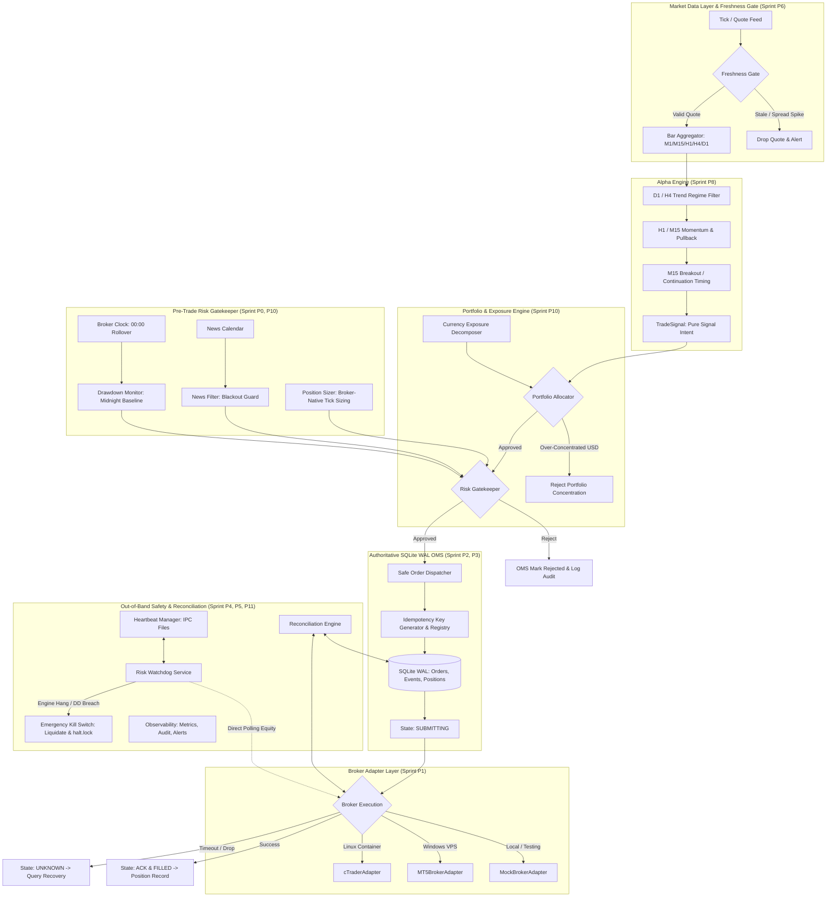

# Institutional Forex Prop Trading System — Production Architecture & Developer Guide

Sistem automated quantitative trading forex modular tingkat institusional berbasis Python yang dirancang secara khusus untuk mematuhi aturan ketat evaluasi dan pengelolaan modal **Proprietary Trading Firm** (Funding Pips, The5ers, FundedNext).

Sistem menerapkan prinsip **Fail-Closed**, **Separation of Concerns**, **Idempotent Order Management (SQLite WAL)**, serta **Out-of-Band Safety Watchdog**.

---

## 📑 Daftar Isi

1. [Spesifikasi Target Prop Firm & Keputusan Eksekutif](#-1-spesifikasi-target-prop-firm--keputusan-eksekutif)
2. [Arsitektur Sistem (P0 - P12 Full Sprint Production)](#-2-arsitektur-sistem-p0---p12-full-sprint-production)
3. [Rincian Komponen Sprints P0 - P12](#-3-rincian-komponen-sprints-p0---p12)
   - [Sprint P0: Correctness Hardening (Broker-Native Tick & Midnight Rollover)](#sprint-p0-correctness-hardening)
   - [Sprint P1: Broker Contract Complete Interface](#sprint-p1-broker-contract-complete-interface)
   - [Sprint P2: Authoritative OMS & SQLite WAL Persistence](#sprint-p2-authoritative-oms--sqlite-wal-persistence)
   - [Sprint P3: Execution Safety, Idempotency & Timeout Recovery](#sprint-p3-execution-safety-idempotency--timeout-recovery)
   - [Sprint P4: Reconciliation Engine & Discrepancy Classifier](#sprint-p4-reconciliation-engine--discrepancy-classifier)
   - [Sprint P5: Safety Plane: Independent Watchdog & IPC Heartbeat](#sprint-p5-safety-plane-independent-watchdog--ipc-heartbeat)
   - [Sprint P6: Market Data Layer & Freshness Gate](#sprint-p6-market-data-layer--freshness-gate)
   - [Sprint P7: Realistic Event-Driven Backtest Simulator](#sprint-p7-realistic-event-driven-backtest-simulator)
   - [Sprint P8: Alpha v1: EURUSD Multi-Timeframe Trend & Momentum](#sprint-p8-alpha-v1-eurusd-multi-timeframe-trend--momentum)
   - [Sprint P9: Quant Research Governance & Empirical Monte Carlo](#sprint-p9-quant-research-governance--empirical-monte-carlo)
   - [Sprint P10: Portfolio Engine & Currency Exposure Decomposition](#sprint-p10-portfolio-engine--currency-exposure-decomposition)
   - [Sprint P11: Observability, Structured Audit & Debounced Alerts](#sprint-p11-observability-structured-audit--debounced-alerts)
   - [Sprint P12: Canary & Paper Trading Soak Test Runner](#sprint-p12-canary--paper-trading-soak-test-runner)
4. [Struktur Direktori Repositori](#-4-struktur-direktori-repositori)
5. [Instalasi & Menjalankan Pengujian](#-5-instalasi--menjalankan-pengujian)
6. [Panduan Operasional & Layanan Daemon](#-6-panduan-operasional--layanan-daemon)

---

## 🏛️ 1. Spesifikasi Target Prop Firm & Keputusan Eksekutif

Berdasarkan audit regulasi prop firm global per September 2026:

| Area | Keputusan Strategis | Catatan Kepatuhan |
| :--- | :--- | :--- |
| **Primary Target** | **FundingPips (2-Step Standard)** | Indonesia didukung penuh, MT5/cTrader, self-developed EA diperbolehkan, Daily Loss = 5% dari $\max(\text{balance}, \text{equity})$ pada 00:00 server time, Max Loss = 10% statis. |
| **Secondary Target** | **The5ers (High Stakes)** | Kompatibel penuh, jeda berita $\pm 2$ menit, overnight holding diizinkan. |
| **Tertiary Target** | **FundedNext** | EA hanya diizinkan untuk akun skala $< \$50\text{k}$. |
| **Status FTMO** | *Excluded / Blocked* | FTMO secara resmi memblokir pendaftaran residen Indonesia (`/block/ID.html`). |
| **Platform Eksekusi Utama** | **MT5 native Python di Windows VPS** | Latensi diukur secara riil (bukan asumsi statis LD4). |
| **Platform Eksekusi Sekunder**| **cTrader Open API native Python** | Linux/Docker microservice compatibility. |
| **Instrumen Utama (V0)** | **EURUSD** | Likuiditas terdalam, spread tertipis, tidak ada risiko cross-rate currency unhedged. |
| **Ekspansi Portofolio** | **USDJPY $\to$ GBPUSD $\to$ XAUUSD** | Dilengkapi pengurai konsentrasi eksposur mata uang tunggal (*currency decomposition*). |
| **Persistensi State OMS** | **SQLite WAL (`PRAGMA synchronous=FULL`)** | Transaksional, bebas race condition, durable melintasi restart proses. |
| **Safety Governance** | **Fail-Closed Architecture** | Setiap anomali yang tidak dapat disinkronkan secara aman langsung mengunci risiko (`LOCK NEW RISK`). |

---

## 📐 2. Arsitektur Sistem (P0 - P12 Full Sprint Production)



---

## 🔍 3. Rincian Komponen Sprints P0 - P12

### Sprint P0: Correctness Hardening
- **Broker-Native Tick Economics (`src/broker/models.py`)**: Dataclass `SymbolSpec` memetakan parameter resmi broker MT5/cTrader: `tick_size`, `tick_value`, `contract_size`, `volume_min`, `volume_max`, `volume_step`, `digits`.
- **Broker Clock Abstraction (`src/broker/clock.py`)**: Antarmuka `BrokerClock` dengan implementasi `ServerTimeClock` (berbasis `Europe/Nicosia` timezone Funding Pips/cTrader) dan `MockBrokerClock` untuk testing deterministik.
- **Kebijakan Prop Firm (`src/risk/policies.py`)**: Strategy pattern `PropFirmPolicy` memisahkan aturan:
  - `FundingPipsPolicy`: Baseline harian $\max(\text{balance}, \text{equity})$ pada 00:00 server time.
  - `The5ersPolicy`: Aturan High Stakes dengan proteksi jendela berita.
  - `FundedNextPolicy`: Validasi batas evaluasi.
- **P0-4 Hard Risk Floor (`src/risk/position_sizer.py`)**: Jika lot aman yang dihitung berdasarkan jarak SL lebih kecil daripada `volume_min` broker, sistem **WAJIB menolak (return 0.0)**. Dilarang menaikkan lot ke `volume_min` karena akan memperbesar risiko melebihi batas akun!

### Sprint P1: Broker Contract Complete Interface
- **Base Broker Adapter (`src/broker/base.py`)**: Kontrak abstrak seragam untuk seluruh adapter:
  - Konektivitas: `connect()`, `disconnect()`, `health()`, `get_server_time()`
  - Akun & Simbol: `get_account_snapshot()`, `get_symbol_spec()`, `get_symbol_price()`
  - Manajemen Order & Posisi: `get_positions()`, `get_open_positions_count()`, `execute_order()`, `get_order()`, `cancel_order()`, `close_position()`, `close_all_positions()`.
- **Implementasi Lengkap**: `MockBrokerAdapter` (pengembangan di macOS) dan `MT5BrokerAdapter` (Windows VPS).

### Sprint P2: Authoritative OMS & SQLite WAL Persistence
- **Order State Machine (`src/oms/states.py`)**:
  - `CREATED` $\to$ `RISK_APPROVED` $\to$ `SUBMITTING` $\to$ `SENT` $\to$ `ACKNOWLEDGED` $\to$ `FILLED`
  - Cabang: `REJECTED`, `CANCELLED`, `EXPIRED`, `UNKNOWN`.
- **SQLite WAL Durability (`src/oms/repository.py`)**:
  - `PRAGMA journal_mode=WAL; PRAGMA synchronous=FULL;`
  - Menyimpan tabel `orders`, `order_events` (append-only audit trail), `fills`, `positions`, dan `system_events`.
- **Pre-Side Effect Guarantee (`src/oms/service.py`)**:
  - Intent order wajib tercatat dan tersimpan di database lokal **sebelum** panggilan soket/jaringan dikirim ke broker.

### Sprint P3: Execution Safety, Idempotency & Timeout Recovery
- **Idempotency Key Generator (`src/execution/idempotency.py`)**:
  - Format deterministik: `QP-<PROP>-<YYYYMMDD>-<SYMBOL>-<HEX8>` (misal `QP-FP-20260920-EURUSD-a1b2c3d4`).
  - Thread-safe registry mencegah double-firing dari sinyal berulang atau retry jaringan.
- **Safe Dispatcher Pipeline (`src/execution/dispatcher.py`)**:
  - Mengintegrasikan Gatekeeper, OMS, dan Broker Adapter.
  - Jika terjadi timeout/network drop, order ditandai `UNKNOWN` (dilarang blind-resend!). Dispatcher langsung menjalankan kueri pemulihan via `client_order_id`.

### Sprint P4: Reconciliation Engine & Discrepancy Classifier
- **Klasifikasi Selisih (`src/reconciliation/classifier.py` & `reconciler.py`)**:
  1. `MISSING_ACK_RESOLVED`: Order unknown terisi di broker $\to$ diadopsi dan disinkronkan ke OMS.
  2. `GHOST_LOCAL_POSITION`: Posisi tercatat OPEN di OMS tapi sudah hilang di broker $\to$ ditutup di OMS lokal.
  3. `ORPHAN_BROKER_POSITION`: Posisi milik bot (`QP-`) ada di broker tapi hilang di OMS $\to$ diadopsi.
  4. `UNKNOWN_EXTERNAL_POSITION`: Posisi manual atau dari EA lain $\to$ **FAIL-CLOSED: Kunci risiko (`LOCK NEW RISK`)**.
  5. `EMERGENCY_LIMIT_BREACH`: Drawdown menyentuh batas kritis $\to$ **Likuidasi darurat & HALT**.

### Sprint P5: Safety Plane: Independent Watchdog & IPC Heartbeat
- **Heartbeat IPC (`src/safety/heartbeat.py`)**: Mekanisme penulisan berkala liveness timestamp file JSON antar-proses (`storage/heartbeats/`).
- **Independent Risk Watchdog (`src/safety/watchdog.py`)**:
  - Beroperasi pada proses terpisah, membaca equity broker langsung secara independen.
  - Memonitor liveness trading engine: Jika trading engine mati/hang $> 15$ detik saat masih ada posisi terbuka di broker, watchdog memicu **Orphan Protection (likuidasi otomatis & pembuatan file halt.lock)**.

### Sprint P6: Market Data Layer & Freshness Gate
- **Normalized Data Models (`src/data/market.py`)**: Dataclass `Quote` dan `Bar`.
- **Freshness Gatekeeper (`src/data/validation.py`)**: Menolak data kadaluarsa (age $> 5$s), anomali waktu masa depan (*clock skew*), harga tidak positif, spread terbalik (*inverted spread*), atau lonjakan spread (*spread spike* $> 3$ pips).
- **Multi-Timeframe Resampler (`src/data/bars.py`)**: Mengubah tick / bar rendah menjadi OHLCV multi-timeframe teragregasi.

### Sprint P7: Realistic Event-Driven Backtest Simulator
- **Simulator Friksi Nyata (`research/backtest/simulator.py`)**:
  - Event-driven per candlestick bar dengan pemeriksaan Stop Loss dan Take Profit intra-bar.
  - Memasukkan biaya komisi riil ($3/lot), spread dinamis, slippage, dan biaya swap overnight.
  - Menghitung drawdown harian dari baseline tengah malam $\max(\text{balance}, \text{equity})$ pada setiap bar, menghentikan simulasi jika terjadi pelanggaran aturan prop firm.

### Sprint P8: Alpha v1: EURUSD Multi-Timeframe Trend & Momentum
- **Strategi Institusional (`src/strategy/trend_v1.py`)**:
  - Filter Rezim D1/H4: EMA 50 dan EMA 200 sebagai penentu bias tren.
  - Setup Menengah H1/M15: Pullback RSI dan zona EMA.
  - Timing Eksekusi M15: Breakout level swing high/low sebelumnya dan konfirmasi kelanjutan tren.
  - Stop Loss dinamis berbasis ATR ($1.5 \times \text{ATR}_{14}$) dengan rasio Risk:Reward $\ge 1:2.0$.
  - Hanya menghasilkan `TradeSignal` murni tanpa menyentuh sizing lot (sizing diisolasi di `PositionSizer`).

### Sprint P9: Quant Research Governance & Empirical Monte Carlo
- **Bootstrap Resampling Non-Parametrik** — *DIHAPUS bersama studi komparasi FX.*
  - Modul `research/validation/` (monte_carlo, ablation_analysis, regimes, walk_forward)
    dan `research/evaluation/prop_simulator.py` telah dihapus karena tidak berkaitan
    dengan target eksekusi FundingPips.
  - Yang **tetap dipertahankan** adalah kerangka tata kelola riset yang dilindungi:
    `research/protocol/` (frozen config, fold plan, audit log), `research/phase3-6`,
    dan `research/backtest/simulator_v2.py`.

### Sprint P10: Portfolio Engine & Currency Exposure Decomposition
- **Pengurai Eksposur Mata Uang (`src/portfolio/exposure.py`)**:
  - Memecah posisi EURUSD, USDJPY, GBPUSD, dan XAUUSD menjadi eksposur bersih per mata uang fiat (USD, EUR, GBP, JPY).
  - Mencegah korelasi tersembunyi (misal: BUY EURUSD + BUY GBPUSD melipatgandakan risiko SHORT USD).
- **Alokator Portofolio (`src/portfolio/allocator.py`)**:
  - Membatasi plafon eksposur mata uang tunggal ($\le \$250,000$ nosional) dan membatasi jumlah posisi portofolio simultan.

### Sprint P11: Observability, Structured Audit & Debounced Alerts
- **Kolektor Metrik (`src/observability/metrics.py`)**: Mengukur round-trip latency eksekusi, persentil p95, slippage empiris, dan success rate.
- **Audit Trail Terstruktur (`src/observability/audit.py`)**: Mencatat setiap mutasi order, keputusan risiko, dan rekonsiliasi ke tabel `system_events` di SQLite.
- **Alert Dispatcher Anti-Spam (`src/observability/alerts.py`)**: Mendukung handler webhook/logger dengan mekanisme *debouncing* (cooldown per topik) untuk mencegah badai notifikasi (*alert storm*).

### Sprint P12: Canary & Paper Trading Soak Test Runner
- **Integration Test Harness (`services/canary_runner.py`)**:
  - Memverifikasi 6 pilar kesiapan live secara otomatis:
    1. IPC Heartbeat Liveness.
    2. Market Data Freshness Gate (lolos fresh, tolak stale).
    3. News Blackout Guard (tolak saat rilis high-impact).
    4. Safe Order Execution & SQLite WAL State.
    5. Discrepancy Reconciliation Check.
    6. Portfolio Allocation & Exposure Limit.

---

## 📂 4. Struktur Direktori Repositori

```
prop-trading-system/
├── config/
│   ├── prop_rules.py             # Model parameter batas prop firm (Funding Pips, The5ers)
│   └── settings.py               # Pengaturan global environment & credential
├── src/
│   ├── broker/
│   │   ├── base.py               # Kontrak BaseBrokerAdapter, OrderResult, PositionInfo
│   │   ├── clock.py              # BrokerClock, ServerTimeClock (Europe/Nicosia), MockClock
│   │   └── models.py             # SymbolSpec broker-native tick economics
│   ├── data/
│   │   ├── bars.py               # Aggregator & resampler OHLCV
│   │   ├── market.py             # Model Quote & Bar
│   │   ├── news_calendar.py      # Fetcher & parser kalender ekonomi
│   │   └── validation.py         # FreshnessGate & validator data market
│   ├── execution/
│   │   ├── broker_adapter.py     # MockBrokerAdapter & MT5BrokerAdapter
│   │   ├── dispatcher.py         # Safe OrderDispatcher pipeline
│   │   ├── idempotency.py        # IdempotencyRegistry & generate_client_order_id
│   │   └── order_manager.py      # Atomic dispatch backward-compatibility
│   ├── oms/
│   │   ├── models.py             # Domain dataclass: Order, OrderEvent, Fill, PositionRecord
│   │   ├── repository.py         # Authoritative SQLite WAL Repository
│   │   ├── service.py            # OMSService & State Machine coordinator
│   │   └── states.py             # OrderState & OrderEventType FSM
│   ├── portfolio/
│   │   ├── allocator.py          # PortfolioAllocator & risk budgeting
│   │   └── exposure.py           # PortfolioExposureManager & Currency decomposition
│   ├── reconciliation/
│   │   ├── classifier.py         # Klasifikasi anomali state
│   │   ├── models.py             # DiscrepancyType, DiscrepancyAction, Reports
│   │   ├── policies.py           # Kebijakan rekonsiliasi fail-closed
│   │   └── reconciler.py         # ReconciliationEngine
│   ├── risk/
│   │   ├── drawdown_monitor.py   # Pemantau drawdown harian (00:00 rollover) & total
│   │   ├── gatekeeper.py         # Pre-Trade Risk Gatekeeper
│   │   ├── news_filter.py        # Filter blackout berita ekonomi
│   │   ├── policies.py           # FundingPipsPolicy, The5ersPolicy, FundedNextPolicy
│   │   └── position_sizer.py     # Kalkulator lot aman broker-native & Hard Floor
│   ├── safety/
│   │   ├── heartbeat.py          # IPC Heartbeat Manager berbasis file JSON
│   │   ├── kill_switch.py        # EmergencyKillSwitch & halt.lock
│   │   ├── leader_lock.py        # Split-Brain Protection & Exclusive Leader Lock
│   │   ├── startup_guard.py      # Pre-Flight Boot Safety & Naked Trade Check
│   │   └── watchdog.py           # Out-of-Band RiskWatchdog
│   ├── storage/
│   │   ├── health.py             # SQLite Integrity Diagnostics & WAL Sizing
│   │   └── migration.py          # Schema Versioning & Compatibility Manager
│   ├── strategy/
│   │   ├── base.py               # BaseStrategy, TradeSignal, SignalAction
│   │   ├── sample_strategy.py    # EMA + ATR baseline strategy
│   │   └── trend_v1.py           # Alpha v1: EURUSD Multi-Timeframe Trend Strategy
│   └── observability/
│       ├── alerts.py             # AlertManager dengan debouncing
│       ├── audit.py              # AuditLogger terstruktur ke SQLite
│       └── metrics.py            # MetricsCollector untuk latensi & slippage
├── research/
│   ├── backtest/
│   │   ├── costs.py              # Model biaya: spread, komisi, slippage, swap
│   │   ├── simulator.py          # Event-driven simulator penegak aturan prop firm
│   │   └── simulator_v2.py       # Simulator v2: akuntansi yang tidak bisa berbohong
│   ├── execution/
│   │   └── calibrate_fundingpips.py  # Profile FundingPips -> SimulationCostParameters
│   ├── protocol/                 # Tata kelola riset: frozen config, fold plan, audit log
│   ├── phase3_vr_veto.py         # VR sebagai veto rezim (bukan sinyal)
│   ├── phase4_cost_session.py    # Cost gate + kebijakan sesi
│   ├── phase5_walkforward.py     # Walk-forward dengan hasil tersegel
│   └── phase6_falsification.py   # 15 kasus stres pra-deklarasi
├── scripts/
│   ├── backup_db.py              # Non-blocking online hot backup (VACUUM INTO)
│   ├── nssm_install_services.bat # Windows Service installer
│   ├── run_production_services.ps1 # Supervisor dual-process Windows VPS
│   ├── test_order_lifecycle.py   # Script uji lifecycle order demo
│   └── verify_mt5_connection.py  # Pre-flight diagnostic koneksi MT5 VPS
├── services/
│   ├── trading_engine.py         # Daemon utama eksekusi trading
│   ├── risk_watchdog.py          # Daemon independen out-of-band watchdog
│   ├── canary_runner.py          # Runner pengujian canary & fault injection
│   └── paper_soak.py             # Institutional Paper Trading Soak Test Harness
├── tests/
│   ├── chaos/                    # Adversarial Chaos & Failure Injection (7 skenario)
│   └── unit/                     # Test suite komprehensif Sprint P0 - P19 (81 tests)
└── storage/                      # SQLite DB, WAL files, dan IPC heartbeats
```

---

## ⚡ 5. Instalasi & Menjalankan Pengujian

### Setup Virtual Environment
```bash
python3 -m venv .venv
source .venv/bin/activate
pip install -r requirements.txt
```

### Menjalankan Seluruh Unit & Chaos Test Suite (81 Tests / 100% Pass)
```bash
.venv/bin/pytest tests/ -v
```

Hasil benchmark pengujian komprehensif:
```text
============================== 81 passed in 1.01s ==============================
- Sprints P0 - P12: Correctness, Broker Contract, OMS SQLite WAL,
  Idempotency Dispatcher, Reconciliation, Watchdog, Market Freshness,
  Backtest Simulator, Alpha v1 Strategy, Monte Carlo, Portfolio Engine,
  Observability, dan Canary Soak Runner.
- Phase 14 Hardening:
  * P14 Infrastructure: Migration, SQLite Health, Hot Backup, ClockProvider, LeaderLock, ConfigValidator, StartupGuard.
  * P15 Broker Demo Lifecycle: Pre-flight MT5 connection & full order lifecycle flow.
  * P16 Chaos Engineering: 7 Failure Injection Scenarios (Engine crash, Network drop, DB failure, Quote freeze, Split-brain, Bad config, Clock drift).
  * P17 Prop Evaluation Simulator: Block & IID bootstrap survival analytics.
  * P18 Alpha Research: Deterministic Regime Classifier, Factor Ablation, Walk-Forward.
  * P19 Paper Trading Soak: Continuous soak test harness with live health audits.
```

---

## 🚀 6. Panduan Operasional & Layanan Daemon

### 1. Menjalankan Paper Trading Soak Harness (Sprint P19)
Jalankan harness soak simulasi untuk memverifikasi ketahanan sistem secara berkelanjutan di bawah injeksi kesalahan acak:
```bash
PYTHONPATH=. .venv/bin/python services/paper_soak.py --cycles 100
```

### 2. Menjalankan Canary Pre-Flight Check (Sprint P12)
Sebelum mengizinkan live order di VPS, jalankan uji kepatuhan canary 6 komponen:
```bash
PYTHONPATH=. .venv/bin/python services/canary_runner.py
```

### 3. Menjalankan Online Database Hot Backup (Sprint P14)
Jalankan backup non-blocking SQLite WAL menggunakan `VACUUM INTO`:
```bash
PYTHONPATH=. .venv/bin/python scripts/backup_db.py --db storage/trading.db --backup-dir backups
```

### 4. Pemeriksaan Koneksi FundingPips (read-only)
```bash
python -m scripts.fundingpips_connection_check
```
Lihat [docs/FUNDINGPIPS_MT5.md](docs/FUNDINGPIPS_MT5.md) untuk alur lengkap:
symbol probe, spread recorder, dan smoke-test dua-gate.

### 5. Menjalankan Layanan di Windows VPS (Dual-Process Monolith)
Di lingkungan produksi Windows Server VPS, sistem dijalankan menggunakan NSSM (*Non-Sucking Service Manager*) atau PowerShell supervisor script:
```powershell
# Jalankan supervisor dual-process di PowerShell Administrator
.\scripts\run_production_services.ps1
```
Atau install sebagai Windows Background Services:
```cmd
scripts\nssm_install_services.bat
```

### 6. Prosedur Darurat & Kunci Kritis (`halt.lock`)
Jika terjadi kondisi darurat di mana sistem mengunci dirinya sendiri (drawdown kritis, engine mati mendadak, atau kegagalan rekonsiliasi):
1. File `halt.lock` akan tercipta di direktori root.
2. Seluruh order baru otomatis ditolak oleh Gatekeeper (`FAIL-CLOSED`).
3. Seluruh posisi aktif di broker dilikuidasi secara aman oleh Watchdog.
4. Untuk melepaskan kunci setelah investigasi manusia:
```bash
rm -f halt.lock
```
Lalu jalankan rekonsiliasi ulang untuk memastikan akun kembali sinkron 100%.
